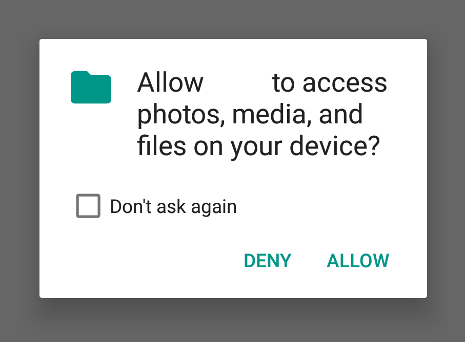

### How should the system's permissions dialog box be selected? (Runtime permissions)

For the apps that have the target API of 23 or above, unlike earlier versions of the Android, the app will no longer be granted dangerous permissions by default, and the application must requires the user to grant permission and can make different actions based on the user's choice.

> Danger permissions refer to permissions that involve user data, such as contacts, location, internal storage, and so on. Other general permissions will still be granted by default.

So when you use the application, you may see the Permissions Request dialog box as shown in the following picture, which is "Runtime Permissions".

But the feature is intended to give users greater choice and right to know. Unfortunately, this feature will be partially exploited by some apps, and if you do not grant non-essential permissions, thoses app will refuse to run.

**AppOps settings and run-time permissions are independent, and AppOps settings determine after the run-time permissions**, that is, in the run-time permissions to select "Allow", AppOps select "disabled", **the final result will be disabled**.

> Note: the application may still be through the system API to know whether it is disabled by AppOps, but the vast majority of applications did not do so.