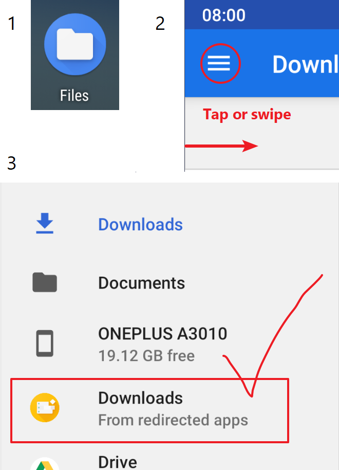

# Everything looks fine, but the redirect doesn't work at all.

Check if log is enabled in "Developer Settings".

In addition, according to user feedback, log disabled by default on Huawei EMUI. If you are using EMUI, please search how to enable log on EMUI.

## Will the previously created file be automatically moved after the redirect is turned on?

No. Files created in internal storage do not have an owner, so automatic movement is not possible. You can manually move or delete those files.
  
## Apps that have the redirect turned on will be automatically granted storage permissions. Is this normal?

Yes. Granting storage permissions during an application run will cause the redirect not work, thus forcing automatic grants.

# Redirected apps still generate files.

Due to the principle, there must be **a certain chance** that the redirect runs later than the logic of redirected apps. Use [Enhancement module](https://rikka.app/storage_redirect/docs/en/?doc=Enhance%20module) to resolve the issue.

In addition, if the app downloads files using the system "Download Manager", the downloaded files will not be redirected due to the principle. This issue may be resolved with the help of the enhancement module in the future.

# Unable to find file in redirected apps

Read [About redirect](https://rikka.app/storage_redirect/docs/en/?doc=About%20redirect) first.

If the file is not in "Non-redirect folders", please move it to "Non-redirect folders", or change "Non-redirect folders" setting,

If the setting is correct but still can't find file, you may need to try to clear the data of the app （optional?) and disable and enable the app's storage permission manually from app info.

# Unable to open file from redirected apps.

> Example: "Open with other app" in "WeChat" app will get "unable to open file"

This is a problem of redirected app, passing file path to other apps. To other app, the file path is wrong.

To solve this problem, please use [Link](https://rikka.app/storage_redirect/docs/en/?doc=About%20link) feature.

A notification will show when new file created if the correct rule is added.
At this time, just tap the notification to open app. (Most popular apps already have user-submitted rules, just add them)

> Example: Correct way to open files received by "WeChat" app
>
> 

Files can also be found through the system's "File" (DocumentUI) app .

> Example: Finding a received file using the Files app
>
> 

# Unable to share to redirected apps.

This is due to design issues with redirected app (and possibly the sharing app).

Please download our [Bridge](https://play.google.com/store/apps/details?id=moe.shizuku.bridge) app to use his "Forward share" feature to solve this problem. (You can also wait for us for other solution)