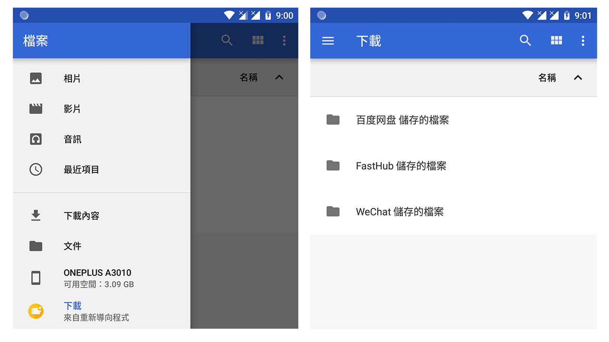
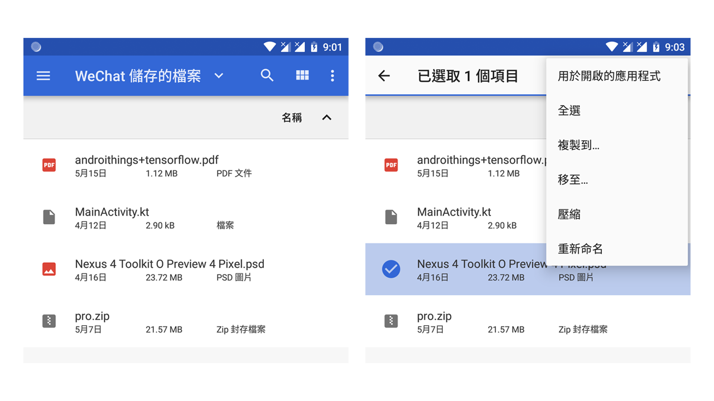

# “Android 文档应用” 是什么？

从 Android 4.4 开始 Google 引入了一种 “存储空间存取框架”，它有助于我们从本地存储、最近下载的项目或第三方文档提供应用（如 Google 云端硬盘）中选取文档位置进行读写。

“Android 文档应用” 则是一个通过 “存储空间存取框架” 浏览文档的管理应用，同时它也负责（接入了框架的）应用程序的文档选取，让用户在不同的存储结构间操作也能拥有统一的体验。

它作为一个 Android 的基建应用，实现了部分有关文档操作的重要接口，几乎所有原生 Android 系统都可以在启动器中找到它的图标，但是部分魔改系统会将其隐藏，甚至有系统将其直接移除导致少部分应用无法正常工作。庆幸的是，“存储重定向” 并不依赖于这套框架和文档应用，但即将介绍的功能需要在它们的支持下运作，如果你发现你的系统没有 “文档” 应用，建议跳过此章说明或尝试下面的修复方式：

- MIUI 系统找回 “文档”：在 “设置” - “开发者人员选项” 中关闭 “MIUI 优化”。

# 如何在 “文档” 应用中查看重定向文件？

当你在 “存储重定向” 中为其它应用打开了重定向且建立了 “启用显示下载通知” 的链接，被链接的文件夹将会在 “文档” 应用中出现。

如图展开 “文档” 抽屉菜单可以找到 “存储重定向” 提供的选项，进入后即可看到重定向文件的分类。

你可以点击直接打开文件，也可以进行各种文件操作。

